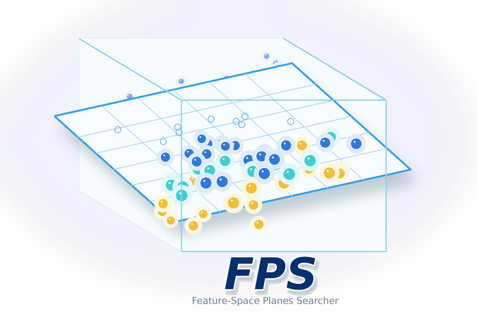

<p align="center">
  
</p>

<h1 align="center">FPS-UDA</h1>

<p align="center">
  Feature-space unsupervised domain adaptation from reusable H5 feature banks.
</p>

<p align="center">
  <a href="https://ieeexplore.ieee.org/abstract/document/11568428">Paper</a>
  ·
  <a href="https://baogegeJiang.github.io/FPS/">Documentation</a>
  ·
  <a href="https://github.com/baogegeJiang/FPS">GitHub</a>
  ·
  <a href="https://huggingface.co/datasets/baogege1995/FPS_H5">Feature Banks</a>
</p>

<p align="center">
  
  
  
</p>

## Overview

FPS-UDA is a PyTorch library for feature-space unsupervised domain adaptation.
It separates image feature extraction from feature-space training:

1. Build or download a dataset-level H5 feature bank.
2. Select source, target, entropy, consistency, and eval feature views.
3. Train FPS from NumPy, Torch, or H5 features.

The package name is `fps-uda`; the import name is `fps_uda`.

## Documentation

The full documentation is split into short GitHub Pages:

| Page | Contents |
| --- | --- |
| [Quick Start](https://baogegeJiang.github.io/FPS/quickstart.html) | install, packaged H5 smoke run |
| [Feature Banks](https://baogegeJiang.github.io/FPS/feature-banks.html) | download, dataset manifests, H5 schema, extraction, analysis, SigLIP2 banks |
| [Training](https://baogegeJiang.github.io/FPS/training.html) | train, sweep, direct CLI view roles, autosearch, Python API |
| [Reference](https://baogegeJiang.github.io/FPS/reference.html) | YAML fields, CLI map, benchmark utilities, repo layout |
| [Advanced](https://baogegeJiang.github.io/FPS/advanced.html) | custom losses, custom backbones, AutoModel vision encoders |

## Install

Install directly from GitHub:

```bash
pip install "fps-uda @ git+https://github.com/baogegeJiang/FPS.git"
```

Clone the repository when you want examples, docs, or the packaged H5 fixture:

```bash
git clone https://github.com/baogegeJiang/FPS.git
cd FPS
pip install -e ".[dev]"
```

Install optional extras only when needed:

```bash
pip install -e ".[vision]"        # feature extraction from images
pip install -e ".[hf]"            # Hugging Face feature-bank download
pip install -e ".[transformers]"  # HF ViT, CLIP, AutoModel vision backbones
```

If you already manage PyTorch and NumPy yourself:

```bash
pip install -e . --no-deps
```

## Quick Start

The repository includes a compressed Office31 `amazon -> webcam` ViT H5 fixture.
Run a two-step smoke test without downloading image datasets:

```bash
PYTHONPATH=src python -m fps_uda.cli train \
  --config configs/examples/office31_amazon_to_webcam_vit_packaged_h5.yaml \
  --iter-num 2 \
  --out runs/examples/office31_aw_vit_smoke
```

After editable install, you can use the console command:

```bash
fps-uda train \
  --config configs/examples/office31_amazon_to_webcam_vit_packaged_h5.yaml \
  --iter-num 2 \
  --out runs/examples/office31_aw_vit_smoke
```

## Released Feature Banks

Benchmark banks are hosted at
[`baogege1995/FPS_H5`](https://huggingface.co/datasets/baogege1995/FPS_H5).
They are stored under the `banks/` subdirectory and downloaded locally to
`fps_h5cache/banks/`.

```bash
PYTHONPATH=src python scripts/download_feature_banks.py all
```

The downloader tries `$HF_ENDPOINT`, `https://huggingface.co`, and
`https://hf-mirror.com`. Force the mirror with:

```bash
PYTHONPATH=src python scripts/download_feature_banks.py all --endpoint hf-mirror
```

Current dataset presets cover Office31, OfficeHome, and VisDA17 with ResNet,
ViT, and SigLIP2/AutoModel-style large vision features. See the
[Feature Banks](https://baogegeJiang.github.io/FPS/feature-banks.html) page for
dataset preparation, extraction, and analysis commands.

## Training

Train from a sectioned YAML config:

```bash
PYTHONPATH=src python -m fps_uda.cli train \
  --config configs/training/office31/amazon_to_webcam/vit.yaml \
  --out runs/office31/amazon_to_webcam/vit
```

Run a sweep:

```bash
PYTHONPATH=src python -m fps_uda.cli sweep \
  --config configs/training/office31/amazon_to_webcam/vit.yaml \
  --alpha-grid 0.6,0.8,1.0 \
  --beta-grid 0.4,0.6 \
  --out runs/sweeps/office31_aw_vit
```

The training API also accepts NumPy/Torch arrays directly through
`FeatureSet`, `FPSConfig`, and `train_fps()`. See
[Training](https://baogegeJiang.github.io/FPS/training.html) and
[Advanced](https://baogegeJiang.github.io/FPS/advanced.html) for custom losses,
custom backbones, and Python-only workflows.

## Paper

This repository accompanies:

**Feature-Space Planes Searcher: A Universal Domain Adaptation Framework for
Interpretability and Computational Efficiency**

[Zhitong Cheng](https://scholar.google.com/citations?hl=zh-CN&user=T4lifpIAAAAJ)+,
[Yiran Jiang](https://scholar.google.com/citations?user=FRCRT-UAAAAJ&hl=zh-CN)+,
Yulong Ge, Yufeng Li, Zhongheng Qin, Rongzhi Lin, and
[Jianwei Ma](https://scholar.google.com/citations?user=6V78tzkAAAAJ&hl=zh-CN)*.

`+` Equal contribution. `*` Corresponding author.

- IEEE Xplore: [document 11568428](https://ieeexplore.ieee.org/abstract/document/11568428)
- Method: Feature-Space Planes Searcher (FPS)
- Task setting: frozen-feature unsupervised domain adaptation

In this public release, we simplified parts of the original feature-bank
extraction augmentations to reduce stochastic variation. Random crop and
contrast perturbations are replaced with deterministic view generation such as
five-crop variants, while random pooling is retained. The public benchmark
hyperparameters were re-searched for these released banks, and the experiment
code was reorganized into a modular library.

## Citation

```bibtex
@article{cheng_fps_uda,
  title  = {Feature-Space Planes Searcher: A Universal Domain Adaptation Framework for Interpretability and Computational Efficiency},
  author = {Cheng, Zhitong and Jiang, Yiran and Ge, Yulong and Li, Yufeng and Qin, Zhongheng and Lin, Rongzhi and Ma, Jianwei},
  journal = {IEEE Transactions on Pattern Analysis and Machine Intelligence},
  url    = {https://ieeexplore.ieee.org/abstract/document/11568428},
  note   = {IEEE Xplore document 11568428}
}
```

## Contributors

This open-source library includes code contributions from:

- [baogegeJiang](https://github.com/baogegeJiang)
- [1eyan](https://github.com/1eyan)
- [Long-louis](https://github.com/Long-louis)
- [sayori1698](https://github.com/sayori1698)
- [ZhongH-Qin](https://github.com/ZhongH-Qin)

We welcome collaborations from researchers and practitioners who would like to
apply FPS-UDA to other domains or build new feature-bank workflows around this
method.

## Repository Layout

```text
src/fps_uda/          Python package
configs/datasets/    feature-bank extraction configs
configs/training/    benchmark training configs
configs/examples/    small runnable examples
examples/            Python customization examples
scripts/             dataset, bank, search, and benchmark helpers
tests/fixtures/      packaged real-H5 example fixture
docs/                GitHub Pages documentation
```

Historical experiment folders are archived under `bak/` and are not public
entry points.
